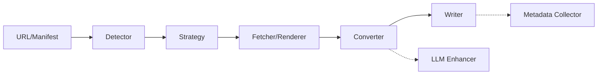

<div align="center">

# RepoDocs

[](https://github.com/quantmind-br/repodocs/actions/workflows/ci.yml)
[](LICENSE)

Extract documentation from websites, Git repositories, sitemaps, package
indexes, and wikis into structured Markdown. RepoDocs supports reproducible RAG
ingestion, local documentation mirrors, and dataset preparation from a single
CLI or manifest.

## Features

-   **Multi-Source Extraction**: Automatically detects and handles various source types:
    -   **Web Crawler**: Recursive crawling of documentation sites.
    -   **Git/GitHub**: Cloning repositories or fetching specific paths.
    -   **Sitemaps**: Systematic discovery via `sitemap.xml`.
    -   **llms.txt**: Support for the emerging `llms.txt` standard for LLM-friendly discovery.
    -   **Package Docs**: Specialized handling for `pkg.go.dev`.
-   **Advanced Processing**:
    -   **HTML to Markdown**: Converts complex HTML into clean Markdown using a multi-stage pipeline.
    -   **Content Extraction**: Uses "readability" logic and CSS selectors to isolate main content and remove noise (navbars, footers, scripts).
    -   **JS Rendering**: Headless browser support (via `go-rod`) for Single Page Applications (SPAs) and JavaScript-heavy sites.
-   **Responsible & Robust Fetching**:
    -   **Site-aware requests**: Configurable HTTP behavior for compatible documentation hosts. Respect each site's robots policy and terms of service.
    -   **Caching**: Persistent caching using BadgerDB to minimize network load and respect rate limits.
    -   **Retries**: Exponential backoff for transient network errors.
-   **AI Integration**: Optional metadata enrichment using LLMs (OpenAI, Anthropic, Google) to generate summaries, tags, and categories.
-   **Structured Output**: Generates Markdown files with YAML frontmatter and a consolidated `repodocs.json` index.

## Installation

### Prerequisites

- **Go 1.24+**
- **Chrome or Chromium** — required only for the `--render-js` feature

### From Source

```bash
git clone https://github.com/quantmind-br/repodocs.git
cd repodocs
make deps
make build
./build/repodocs version
```

### With Go Install

```bash
go install github.com/quantmind-br/repodocs/cmd/repodocs@latest
```

### Install to ~/.local/bin

```bash
make install
```

### Dependency Check

```bash
repodocs doctor
```

Checks for required runtime dependencies (e.g., Chromium for JS rendering).

## Quick Start

Extract documentation from a URL to the default `./docs` directory:

```bash
repodocs https://docs.example.com
```

Extract a GitHub repository with a maximum depth of 2:

```bash
repodocs https://github.com/user/repo --max-depth 2
```

Force JavaScript rendering for a React-based documentation site:

```bash
repodocs https://spa-docs.com --render-js
```

Generate JSON metadata and limit to 10 pages:

```bash
repodocs https://example.com --json-meta --limit 10
```

Process multiple sources from a manifest file:

```bash
repodocs --manifest sources.yaml
```

## Usage

### Common Flags

| Flag | Short | Description | Default |
| :--- | :--- | :--- | :--- |
| `--manifest` | | Path to manifest file (YAML/JSON) for batch processing | |
| `--output` | `-o` | Output directory | `./docs` |
| `--concurrency` | `-j` | Number of concurrent workers | `5` |
| `--max-depth` | `-d` | Maximum crawl depth | `4` |
| `--limit` | `-l` | Maximum pages to process | `0` (unlimited) |
| `--strategy` | | Force strategy: `llms`, `pkggo`, `docsrs`, `sitemap`, `wiki`, `github_pages`, `git`, `crawler` | auto |
| `--render-js` | | Force JavaScript rendering | `false` |
| `--cdp-endpoint` | | Use external CDP browser (e.g. `http://127.0.0.1:9222`) instead of launching Chrome | |
| `--proxy` | | Proxy URL (`http`, `https`, `socks5`, `socks5h`) | |
| `--content-selector` | | CSS selector for main content | |
| `--exclude-selector` | | CSS selector for elements to exclude | |
| `--exclude` | | Regex patterns to exclude | |
| `--filter` | | Path filter (web: base URL; git: subdirectory) | |
| `--include-assets` | | Include referenced images (git strategy) | `false` |
| `--min-docs` | | Min documents for successful extraction; triggers fallback below this | `1` |
| `--no-fallback` | | Disable strategy fallback | `false` |
| `--no-cache` | | Disable the BadgerDB caching layer | `false` |
| `--refresh-cache` | | Force cache refresh | `false` |
| `--cache-ttl` | | Cache TTL | `24h` |
| `--timeout` | | Request timeout | `1m30s` |
| `--user-agent` | | Custom User-Agent | |
| `--json-meta` | | Generate JSON metadata files | `false` |
| `--sync` | | Incremental sync (skip unchanged pages) | `false` |
| `--full-sync` | | Force full re-processing (ignore state) | `false` |
| `--prune` | | Remove files for deleted pages | `false` |
| `--dry-run` | | Simulate without writing files | `false` |
| `--force` | | Overwrite existing files | `false` |
| `--split` | | Split output by sections (pkg.go.dev) | `false` |
| `--config` | | Config file path | `~/.repodocs/config.yaml` |
| `--verbose` | `-v` | Verbose output | `false` |

### Batch Processing with Manifests

For multiple documentation sources, use a manifest file in YAML or JSON. This enables reproducible, one-command data ingestion for complex RAG pipelines.

**Create `sources.yaml`:**

```yaml
sources:
  - url: https://docs.example.com
    strategy: crawler
    content_selector: "article.main"
    max_depth: 3

  - url: https://github.com/org/repo
    strategy: git
    include:
      - "docs/**/*.md"
      - "README.md"

options:
  output: ./knowledge-base
  continue_on_error: true
```

**Run:**

```bash
repodocs --manifest sources.yaml
```

#### Manifest Schema

**Sources** — each source defines a documentation URL and optional configuration:

| Field | Type | Required | Description |
|-------|------|----------|-------------|
| `url` | string | Yes | URL to extract documentation from |
| `strategy` | string | No | Force a strategy (`crawler`, `git`, `sitemap`, etc.) |
| `content_selector` | string | No | CSS selector for main content |
| `exclude_selector` | string | No | CSS selector for elements to remove |
| `exclude` | array | No | URL/path patterns to skip |
| `include` | array | No | Path patterns to include (git strategy) |
| `max_depth` | int | No | Maximum crawl depth |
| `render_js` | bool | No | Force JavaScript rendering |
| `limit` | int | No | Maximum pages from this source |

**Options** — global settings for the whole manifest:

| Field | Type | Default | Description |
|-------|------|---------|-------------|
| `continue_on_error` | bool | `false` | Continue processing if a source fails |
| `output` | string | `./docs` | Output directory for all sources |
| `concurrency` | int | `5` | Number of concurrent workers |

#### Error Handling

By default, execution stops on the first source failure. Use `continue_on_error: true` to process all sources:

```yaml
options:
  continue_on_error: true
```

With this option, failed sources are logged but don't stop execution, all sources are attempted, and the summary shows success/failure counts. The exit code is non-zero if any source failed.

#### Example Manifests

See `examples/manifests/` for sample files: `simple.yaml`, `multi-source.yaml`, `error-tolerant.yaml`, and `full-options.yaml`.

## Configuration

RepoDocs can be configured via CLI flags, environment variables, or a configuration file (default: `~/.repodocs/config.yaml`).

### Configuration Commands

| Command | Description |
|---------|-------------|
| `repodocs config` | Open interactive configuration TUI |
| `repodocs config edit` | Open interactive configuration TUI |
| `repodocs config show` | Display current configuration as YAML |
| `repodocs config init` | Create default config file at `~/.repodocs/config.yaml` |
| `repodocs config path` | Show configuration file path |

### Accessibility

For screen reader support, enable accessible mode:

```bash
# Environment variable
ACCESSIBLE=1 repodocs config

# Flag
repodocs config --accessible
```

### Configuration Categories

The interactive TUI organizes settings into categories: **Output**, **Concurrency**, **Cache**, **Rendering**, **Stealth**, **Logging**, and **LLM** (provider, API key, model, temperature, metadata enhancement).

## How URL Detection Works

RepoDocs tries strategies in a fixed order and uses the first one that matches:

```
llms.txt → pkg.go.dev → docs.rs → sitemap.xml → wiki → GitHub Pages → Git → crawler
```

The crawler is the universal fallback. Pass `--strategy <name>` to force a specific strategy, or `--no-fallback` to disable automatic fallback.

## Architecture

RepoDocs follows a decoupled, interface-driven architecture structured as a processing pipeline:



### Core Components

| Component | Location | Responsibility |
|-----------|----------|----------------|
| Detector & orchestrator | `internal/app/` | Strategy detection, single-URL and manifest runs |
| Strategies | `internal/strategies/` | Per-source extraction (`llms`, `git`, `sitemap`, `pkggo`, `docsrs`, `wiki`, `crawler`) |
| Fetcher | `internal/fetcher/` | Stealth HTTP client, retries, transport |
| Renderer | `internal/renderer/` | Rod/Chromium JS rendering, tab pool |
| Converter | `internal/converter/` | HTML → Markdown pipeline |
| LLM | `internal/llm/` | Provider factory, resilience wrappers, metadata enrichment |
| Cache | `internal/cache/` | BadgerDB-backed persistent cache |
| State | `internal/state/` | Incremental sync state |
| Output | `internal/output/` | Markdown writer, metadata collector |
| TUI | `internal/tui/` | Bubble Tea/Huh config editor |
| CLI | `cmd/repodocs/` | Cobra entrypoint |

## Testing

```bash
make test        # unit tests (short, race-enabled)
make test-all    # full suite (unit + integration + e2e, race-enabled)
make coverage    # coverage report in ./coverage/
```

Additional suites may be run directly:

```bash
go test ./tests/unit/...
go test ./tests/integration/...
go test ./tests/e2e/...
```

Coverage thresholds per package are enforced in CI (`.github/workflows/ci.yml`). See [TESTING.md](TESTING.md) for the full guide.

## Contributing

Contributions are welcome! Please read:

- [CONTRIBUTING.md](CONTRIBUTING.md) — setup, code style, and PR process
- [CODE_OF_CONDUCT.md](CODE_OF_CONDUCT.md) — community guidelines
- [SECURITY.md](SECURITY.md) — how to report vulnerabilities
- [CHANGELOG.md](CHANGELOG.md) — version history

## License

This project is licensed under the [MIT License](LICENSE). © 2025-2026 Diogo Soares Rodrigues.
